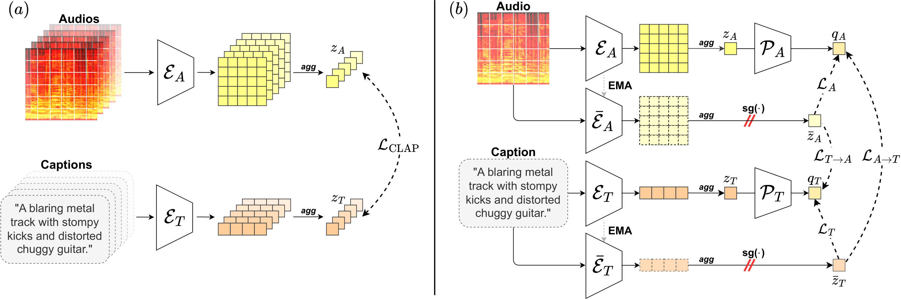
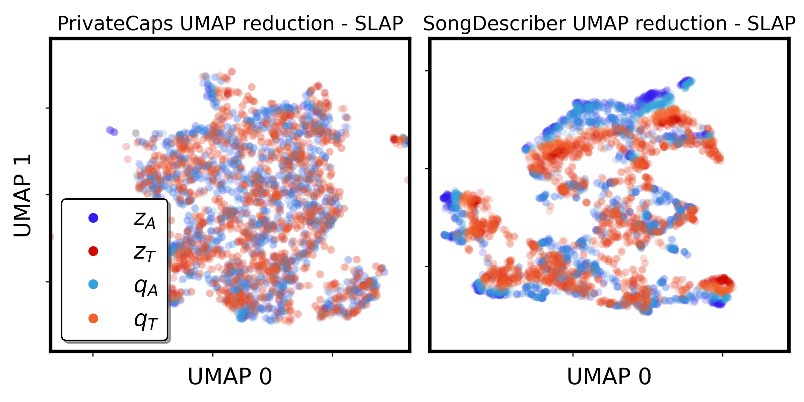
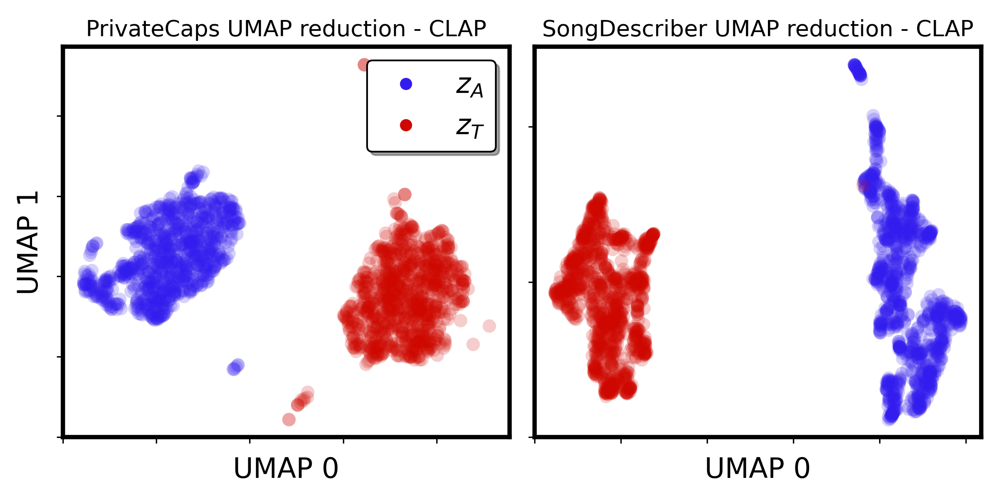

<div align="center">

# SLAP: Siamese Language-Audio Pretraining Without Negative Samples for Music Understanding

**Julien Guinot<sup>\*,1,2</sup>, Alain Riou<sup>\*,3</sup>, Elio Quinton<sup>2</sup>, György Fazekas<sup>1</sup>**  
<sup>1</sup> Centre for Digital Music, Queen Mary University of London, U.K.  
<sup>2</sup> Music & Audio Machine Learning Lab, Universal Music Group, London, U.K.  
<sup>3</sup> LTCI, Télécom-Paris, Institut Polytechnique de Paris, France  
<sup>*</sup>Equal contribution, correspondence to j.guinot@qmul.ac.uk

[](LICENSE)
[](https://arxiv.org/abs/xxxx.xxxxx)

<p align="center">
  
</p>

</div>

---

## Abstract

Joint embedding spaces have significantly advanced music understanding and generation by linking text and audio through multimodal contrastive learning. However, these approaches face large memory requirement limitations due to relying on large batch sizes to effectively utilize negative samples. Further, multimodal joint embedding spaces suffer from a modality gap wherein embeddings from different modalities lie in different manifolds of the embedding space.

To address these challenges, we propose **Siamese Language-Audio Pretraining (SLAP)**, a novel multimodal pretraining framework that allows learning powerful representations without negative samples. SLAP adapts the Bootstrap Your Own Latent (BYOL) paradigm for multimodal audio-text training, promoting scalability in training multimodal embedding spaces. SLAP outperforms CLAP on text-music retrieval and zero-shot classification, and is robust to batch size and modality gap issues.

---

## Highlights
- **No negatives needed:** BYOL-style training for audio-text, removing the need for large batch sizes and negative pairs.
- **Scalable:** Enables large-scale training on a single GPU via gradient accumulation.
- **Reduced modality gap:** Embeddings from different modalities are better aligned.
- **Strong performance:** Outperforms CLAP on text-music retrieval and zero-shot classification.
- **PyTorch Lightning + Hydra:** Modular, reproducible, and easy to configure.

---

# SLAP: Siamese Language-Audio Pretraining Without Negative Samples for Music Understanding

## Usage

To train a model, define your configuration in a YAML file (see `configs/` for examples) and run:

```shell
python src/train.py data=<your_data_config> model=<your_model_config> model/audio_encoder=<your_audio_encoder> model/text_encoder=<your_text_encoder> logger=<your_logger>
```

You can override any config option from the command line, e.g.:
```shell
python src/train.py model/audio_encoder=htsat_slap
```

See the [Hydra docs](https://hydra.cc/) for more info on configuration overrides.


## Code organization

This repo is implemented with [Pytorch Lightning](https://lightning.ai/docs/pytorch/latest/).
For configuration files, it uses [Hydra](https://hydra.cc).
The structure follows this [lightning-hydra-template](https://github.com/ashleve/lightning-hydra-template).

This repo is divided in the following subpackages:
- `configs` contains the recursively defined Hydra configs as YAML files.
- `src` contains the main code:
  - `callbacks` contains home-made callbacks, e.g. for custom logging and visualization.
  - `data` contains data-related stuff, it is divided in `datamodules` (for loading data) and `transforms` for pre-processing, data augmentations, etc.
  - `models` contains main structures implemented as `LightningModule`s. Training procedures should be implemented here.
  A `BaseModule` is already implemented to handle basics.
  - `networks` contains the architectures of neural networks provided as **standard PyTorch** `nn.Module`s.
  In practice, those networks shouldn't be used directly but given as arguments of a `LightningModule` implemented in `models`.
  - `utils` contains almost everything else. In particular, losses and colorful loggers are defined here.

---

## Detailed Usage

### Training

- **Train locally:**
  ```shell
  python src/train.py data=<your_data_config> model=<your_model_config> model/audio_encoder=<your_audio_encoder> model/text_encoder=<your_text_encoder> logger=<your_logger>
  ```
- **Config customization:**
  Edit YAML files in `configs/` or override from the command line, e.g. `model/audio_encoder=htsat_slap`.

### Evaluation

- **Evaluate on test set:**
  ```shell
  python src/train.py test=true ckpt_path=path/to/checkpoint.ckpt
  ```
- **Resume training:**
  ```shell
  python src/train.py resume=true ckpt_path=path/to/checkpoint.ckpt
  ```

### Configuration
- All experiment settings are controlled via Hydra YAML configs in `configs/`.
- See `configs/train.yaml` for the main entry point.
- Paths, model, data, and trainer settings are modular and can be overridden from the command line.

---

## Feature Extraction & Zero-Shot Example

You can use the model to extract features or perform zero-shot similarity as follows:

**Extract audio/text features:**
```python
# Assume 'model' is a loaded SLAP or MusCALL model
# audio: torch.Tensor of shape [batch, ...], text: list of strings
_, audio_emb = model.encode_audio(audio)
_, text_emb = model.encode_text(text)
```

**Zero-shot similarity (e.g., retrieval or probing):**
```python
# Normalize and compute similarity
import torch.nn.functional as F
sim = F.cosine_similarity(audio_emb, text_emb)  # or use (audio_emb @ text_emb.T)
# sim: similarity scores between audio and text
```

---

## Dataset Preparation

SLAP is designed to be flexible: you can use the provided `AudioCSVDataset` (see `src/data/audio_csv.py`) or define your own PyTorch `Dataset` or Lightning `DataModule` for custom data formats.

**Default CSV-based dataset:**
- Prepare a CSV file with columns: `npy_path`, `caption`, `set` (where `set` is one of `train`, `val`, or `test`).
- Audio or spectrogram files should be referenced by `npy_path` (relative to your data root).

Example directory structure:
```
data/
├── audio/
│   ├── track_1.wav
│   ├── track_2.wav
│   └── ...
├── captions.csv  # or .json, with columns: npy_path, caption, set
```

- Update `configs/paths/example.yaml` with your data paths.
- See `configs/data/default.yaml` for expected config fields and how to point to your CSV.
- To use a custom dataset, implement your own `LightningDataModule` and update the `_target_` in your data config.

---

## Results (from the paper)

- **Text-Music Retrieval:** SLAP outperforms CLAP on standard retrieval benchmarks.
- **Zero-Shot Classification:** SLAP achieves competitive results on genre and instrument classification, auto-tagging.
- **Modality Gap:** SLAP reduces the modality gap compared to contrastive approaches.
- **Robustness:** SLAP is robust to batch size and enables large-scale training on a single GPU.

### Main Text-Music Retrieval Results

| Model | Pretrained | Dataset        | Direction      | R@1 | R@5  | R@10 | Median Rank | Mean Rank |
|-------|------------|---------------|---------------|-----|------|------|-------------|----------|
| SLAP  | Yes        | Song Describer| A → T         | 5.7 | 18.1 | 26.6 | 3.2         | 8.9      |
| SLAP  | Yes        | Song Describer| T → A         | 6.0 | 18.1 | 26.4 | 3.6         | 10.5     |
| CLAP  | Yes        | Song Describer| A → T         | 5.3 | 14.9 | 22.2 | 4.3         | 9.2      |
| CLAP  | Yes        | Song Describer| T → A         | 5.7 | 16.8 | 24.1 | 4.3         | 9.7      |
| SLAP  | Yes        | MusicCaps     | A → T         | 3.1 | 10.1 | 15.4 | 1.9         | 7.7      |
| SLAP  | Yes        | MusicCaps     | T → A         | 3.0 | 9.6  | 15.4 | 1.9         | 7.7      |
| CLAP  | Yes        | MusicCaps     | A → T         | 2.8 | 8.3  | 10.4 | 3.0         | 10.0     |
| CLAP  | Yes        | MusicCaps     | T → A         | 2.8 | 8.7  | 14.0 | 2.2         | 7.6      |

<sub>Metrics: R@k = Recall@k (%), Median/Mean Rank (lower is better). All results from the paper, pretrained models.</sub>

The following UMAP visualizations illustrate how SLAP better aligns audio and text embeddings in the joint space, reducing the modality gap compared to contrastive approaches.

<p align="center">
  
</p>


<p align="center">
  
</p>

---

## Citation

If you use this code, please cite:

```bibtex
citation key coming soon
```

---

## License

This repository is released under the MIT License. See [LICENSE](LICENSE) for details.

## Acknowledgements
- Some code adapted from [CLAP](https://github.com/LAION-AI/CLAP) and [MusCALL](https://github.com/ilaria-manco/muscall).
- Built with [PyTorch Lightning](https://lightning.ai/) and [Hydra](https://hydra.cc/).

For questions, contact: j.guinot@qmul.ac.uk
